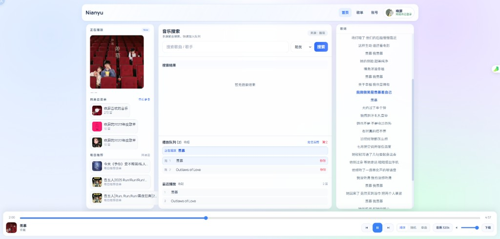

# Nianyu

基于 [GD Studio 音乐 API](https://music-api.gdstudio.xyz/api.php) 与网易云 API 的音乐网站，支持 Docker 部署（含飞牛 NAS）。

## 效果图



---

## 功能说明

### 界面与主题

- **深色主题**：默认深色界面，适合长时间使用。
- **响应式布局**：支持桌面与移动端，自适应不同屏幕。
- **导航结构**：首页（搜索与推荐）、歌单、账号、网易云登录入口，底部全局播放条。

### 搜索与播放

- **多源搜索**：通过 GD Studio API 聚合多平台曲库（如网易云、酷我、JOOX 等），按关键词搜索歌曲。
- **音源选择**：可指定搜索来源与音质（如 320k），获取播放链接后在本站直接播放。
- **播放控制**：播放/暂停、上一曲/下一曲、进度条、音量调节。
- **播放模式**：支持顺序、随机、单曲循环。
- **播放列表与历史**：当前队列、最近播放记录，便于继续听。

### 歌词

- **同步歌词**：播放时展示当前歌曲歌词（含翻译轨若有），随播放进度高亮。

### 网易云账号与歌单

- **网易云登录**：通过网易云 API 登录，会话与 Cookie 由后端安全处理。
- **歌单同步**：登录后可同步「我的歌单」，在本站直接浏览并播放歌单内歌曲（仍通过 GD API 获取可播链接）。
- **喜欢同步到网易云**：在搜索结果中可一键「添加到网易云我喜欢」，将歌曲加入网易云账号的喜欢列表。

### 部署方式

- **本地开发**：前后端分离，前端 Vite 开发服务器代理 `/api` 到后端。
- **生产**：后端 Express 托管前端静态资源，单端口对外。
- **Docker**：提供 Dockerfile 与 docker-compose 示例，便于在服务器或飞牛 NAS 上一键部署；可选用内置网易云 API 服务（如 `moefurina/ncm-api`）或自建。

---

## 使用的 API 与出处

本项目的音乐数据与账号能力依赖以下第三方 API，使用时应遵守其条款并注明出处。

### 1. GD Studio 音乐 API

- **用途**：歌曲搜索、获取播放链接、歌词等。
- **官方地址**：<https://music-api.gdstudio.xyz/api.php>  
- **出处说明**：数据来源为 **GD音乐台**，使用本 API 请注明出处「**GD音乐台 (music.gdstudio.xyz)**」。
- **说明**：GD 音乐台由 GD Studio 运营，暂无公开 GitHub 仓库，以官网为准。

### 2. 网易云音乐 API（兼容实现）

- **用途**：网易云登录状态、用户信息、歌单列表、喜欢列表的添加等。
- **接口兼容**：本项目对接与 **Binaryify/NeteaseCloudMusicApi** 接口兼容的网易云 API 服务（需自建或使用可用的合规服务）。
- **常见实现与 GitHub 地址**：
  - [Binaryify/NeteaseCloudMusicApi](https://github.com/Binaryify/NeteaseCloudMusicApi)（网易云音乐 Node.js API，已归档，可作参考或 fork 自建）
  - [NeteaseCloudMusicApiEnhanced/api-enhanced](https://github.com/NeteaseCloudMusicApiEnhanced/api-enhanced)（增强版，可自建使用）
- **Docker 示例**：`docker-compose.yml` 中可选使用 `moefurina/ncm-api` 等镜像作为网易云 API 后端，请自行确认镜像来源与合规性。

---

## 开源与使用声明

- **开源**：本项目仅供学习与个人使用，采用开源方式分享。
- **禁止商用**：未经授权不得将本项目或基于本项目的衍生版本用于任何商业用途。音乐内容版权归 GD Studio、网易云音乐及相应版权方所有，请勿将本项目用于商业目的。
- **免责**：音乐数据来源于 GD Studio 与网易云等第三方，使用者需自行承担合规与版权责任；作者不对因使用、自建 API 或第三方服务而产生的任何问题负责。

---

## 环境要求

- Node.js 18+
- 网易云相关功能需配置 **网易云 API**（自建或使用与 Binaryify/NeteaseCloudMusicApi 兼容的服务，如 [NeteaseCloudMusicApiEnhanced](https://github.com/NeteaseCloudMusicApiEnhanced/api-enhanced)）

## 本地开发

```bash
# 安装依赖
npm install
cd client && npm install && cd ..

# 同时启动后端(5174)与前端(5173，代理 /api 到后端)
npm run dev
```

访问 http://localhost:5173 。后端默认使用 GD API，网易云需设置环境变量 `NETEASE_API`。

## 生产构建

```bash
npm run build:client
# 然后使用 node 运行 server，或见下方 Docker
```

## Docker 镜像与自动构建

- **镜像地址**：[ghcr.io/lidachui1998/nianyu](https://github.com/lidachui1998/Nianyu/pkgs/container/nianyu)（GitHub Container Registry）
- **自动构建**：推送代码到 `main` 分支或打 `v*` 标签时，[GitHub Actions](.github/workflows/docker-publish.yml) 会自动构建并推送镜像，无需本地 build。

## Docker 部署（飞牛 NAS / 服务器）

使用仓库内的 `docker-compose.yml`，直接拉取镜像部署，无需本地构建：

```bash
# 克隆仓库（仅需 docker-compose.yml，也可单独下载此文件）
git clone https://github.com/lidachui1998/Nianyu.git && cd Nianyu

# 拉取镜像并启动
docker-compose up -d
```

访问：`http://<本机或 NAS IP>:5174`。

**数据持久化**：`docker-compose.yml` 已将部署目录下的 `./data` 挂载到容器内 `/app/data`，歌单、同步记录、用户/网易云登录状态会保存在当前目录的 `data` 文件夹，重启或重建容器不会丢失。

**网易云 API 配置**（在 `docker-compose.yml` 的 `nianyu` 服务下修改 `environment`）：

| 方式 | 说明 |
|------|------|
| **默认** | 使用 compose 内置的 `netease-api` 服务，无需改配置，启动即用。 |
| **自建/第三方** | 将 `NETEASE_API` 改为你的网易云 API 地址（如 `https://your-api.com`），并注释掉 `depends_on` 与下方的 `netease-api` 服务。 |
| **不启用** | 删除或留空 `NETEASE_API`，并注释掉 `depends_on` 与 `netease-api` 服务。 |

## 环境变量

| 变量 | 说明 | 默认 |
|------|------|------|
| `PORT` | 服务端口 | 5174 |
| `GD_API` | GD 音乐 API 地址 | https://music-api.gdstudio.xyz/api.php |
| `NETEASE_API` | 网易云 API 根地址（自建或可用） | 空（不配置则歌单/喜欢不可用） |
| `SESSION_SECRET` | 会话加密密钥，生产请修改 | 内置默认值 |
